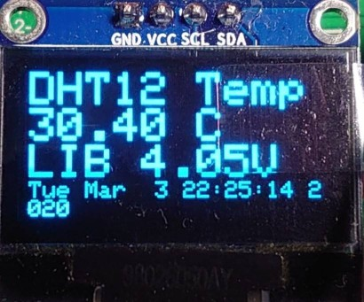

# EDU01M 整合測試 #

#功能說明#

## 開機模式 ##

- 一般模式 
上電後正常開機，依預設網路進行連線，連線後會取得網路時間，並發送設備控制連結，可由網頁控制開發版，取得開發版狀態，TimeOut時間6分鐘，當無法連線時，設備將自動重啟。

- 配置模式 
短按按鈕，開機時，同時按下按鈕開關，當燈號亮起後放開，燈號快閃，進入系統配置模式，等待使用者連線設定。

- 單機模式 
長按按鈕，開機時，同時按下按鈕開關，當燈號長滅，大約三秒以上，進入單機模式，系統將以單機運行，不處理所有網路連線作業。

## 感測引腳 ##
系統預設的引腳連線如下 
- LED指示 
連接 **GPIO 0**，使用MCU內部的上拉電路，燒錄韌體時，需要將 GPIO 0 接地(GND)並重啟進入燒錄模式。

- 按鈕開關 
連接 **GPIO 12**，開關模組，使用MCU內部的上拉電路，需以INPUT_PULLUP模式進行操作。

- 蜂鳴器 
連接 **GPIO 9**，預設的事件驅動引腳，可在配置模式中，更改事件驅動引腳，當人體、氣體、比較器等等感測器觸發時，產生事件驅動 HIGH 訊號。

- 繼電器開關 
連接 **GPIO 10**，使用 HIGH、LOW 控制外部開關，可在配置模式中，更改事件驅動引腳。

- 人體感測 
連接 **GPIO 13**，預設觸發時，訊號為 LOW，未觸發時，訊號為 HIGH。

- 氣體感測 
連接 **GPIO 16**，可連接 MQ2 等等的氣體感測模組，讀取數位引腳，當事件觸發時，訊號為 HIGH。

- 比較器A,B 
連接 **GPIO 2**，有兩組比較器提供連接，分別為(A+,A-)與(B+,B-)，可連接火焰感測模組或雨滴感測模組等等，事件觸發時，訊號偵測為 HIGH，且板上有出發燈號與各自的靈敏度調節器。

- 紅外線接收 
連接 **GPIO 14**，紅外線接收是用來學習其他遙控器的紅外線訊號，當系統開機後，長按按鈕開關，直到蜂鳴器發出一短聲，系統會進入紅外線學習模式，3秒間進行紅外線學習，當學習完成或逾時，蜂鳴器發出兩短聲結束學習，想要切換不同的訊息組，只能由開機發送的超連結網頁中，選擇不同的紅外線按鈕。

- 紅外線發射 
連接 **GPIO 15**，用來發射紅外線訊號，以便控制紅外線家電設備，如冷氣、風扇等等，當系統開機後，按放按鈕開關會進行紅外線發射，預設為紅外線第一組訊息，從開機提供的網路連結訊息，可以控制四組紅外線按鈕。

- 電壓量測 
連接 **ADC 0**，為類比輸入引腳，用來讀取電池的電壓，測量時，A0連接到開發板的A0端口，電池正極連接太陽能電壓測量正極，可量測的電壓範圍從 0~20V。

## 畫面資訊 ##
學習版上有 OLED 單色螢幕的擴充插槽，可顯示攝氏溫度與電池電壓，以及當前的日期時間，當事件觸發，狀態會立即顯示，無觸發時，每分鐘會更新一次數據。 
