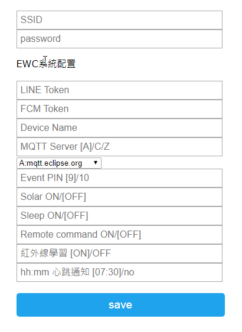

# EDU01M 整合測試 #

# 完整功能說明 #

## 開機模式 ##

- 一般模式 
上電後正常開機，依預設網路進行連線，連線後會取得網路時間，並發送設備控制連結，可由網頁控制開發版，取得開發版狀態，TimeOut時間6分鐘，當無法連線時，設備將自動重啟。

- 配置模式 
短按按鈕，開機時，同時按下按鈕開關，當燈號亮起後放開，燈號快閃，進入系統配置模式，等待使用者連線設定，進入此模式後，可以短按按鈕進行 **WPS** 連線配置支援。

- 單機模式 
長按按鈕，開機時，同時按下按鈕開關，當燈號長滅，大約三秒以上，進入單機模式，系統將以單機運行，不處理所有網路連線作業。

## 感測引腳 ##
系統預設的引腳連線如下： 

- **LED指示** 
連接 **GPIO 0**，使用 MCU 內部的上拉電路，燒錄韌體時，需要將 GPIO 0 接地(GND)並重啟進入燒錄模式。

- **按鈕開關 (SW-IN)** 
連接 **GPIO 12**，開關模組，使用 MCU 內部的上拉電路，需以 **INPUT_PULLUP** 模式進行操作。

- **蜂鳴器 (Beep)** 
連接 **GPIO 9**，預設的事件驅動引腳，可在配置模式中，更改事件驅動引腳，當人體、氣體、比較器等等感測器觸發時，產生事件驅動 HIGH 訊號。

- **繼電器開關 (Relay)** 
連接 **GPIO 10**，使用 **HIGH**、LOW 控制外部開關，可在配置模式中，更改事件驅動引腳。

- **人體感測 (HUIR)** 
連接 **GPIO 13**，預設觸發時，訊號為 **HIGH**，未觸發時，訊號為 LOW。

- **氣體感測 (MQ-DIN)** 
連接 **GPIO 16**，可連接 MQ2 等等的氣體感測模組，讀取數位引腳，當事件觸發時，訊號為 **LOW**。 
當 **GPIO 16** 連接 **RST** 引腳，且有設置啟動休眠時，可進入休眠模式，當18650電池電壓低於3.4，太陽能電池電壓低於10.6時，ESP會進入休眠，且每小時喚醒一次。

- **比較器A,B (L393-A,L393-B)** 
連接 **GPIO 2**，有兩組比較器提供連接，分別為(A+,A-)與(B+,B-)，可連接火焰感測模組或雨滴感測模組等等，事件觸發時，訊號偵測為 **LOW**，且板上有觸發的燈號與各自的靈敏度調節器。

- **紅外線接收 (IR-IN)** 
連接 **GPIO 14**，紅外線接收是用來學習其他遙控器的紅外線訊號，當系統開機後，長按按鈕開關，直到蜂鳴器發出一短聲，系統會進入紅外線學習模式，3秒間進行紅外線學習，當學習完成或逾時，蜂鳴器發出兩短聲結束學習，想要切換不同的訊息組，只能由開機發送的超連結網頁中，選擇不同的紅外線按鈕。

- **紅外線發射 (IR-OUT)** 
連接 **GPIO 15**，用來發射紅外線訊號，以便控制紅外線家電設備，如冷氣、風扇等等，當系統開機後，按放按鈕開關會進行紅外線發射，預設為紅外線第一組訊息，從開機提供的網路連結訊息，可以控制四組紅外線按鈕。

- **電壓量測** 
連接 **ADC 0** ，為類比輸入引腳，用來讀取電池的電壓，測量時，ESP01M的 **ADC(A0)** 連接到ADS1115模組的 **A0** 端口，電池正極連接太陽能電壓測量正極，可量測的電壓範圍從 0~20V；當設置啟動太陽能模式 **(Solar ON)** ，偵測的電壓為ADS1115的A1端口，測量的電壓以12V的太陽能電池為測量依據。

- **I2C通訊** 
連接 **GPIO 4,5** ，I2C通訊使用兩隻引腳，可控制多項傳感器，內建支援包含 **DHT12** 的溫溼度感測、 **OLED** 顯示屏幕、 **ADS1115** 高精度類比輸入、 **INA219** 電流電壓功率感測等等。

## 畫面資訊 ##
學習版上有 OLED 單色螢幕的擴充插槽，可顯示攝氏溫度與電池電壓，以及當前的日期時間，當事件觸發，狀態會立即顯示，無觸發時，每秒會更新一次畫面，可當作電子時鐘應用，每分鐘會對溫度與電壓發送異常偵測通知，當溫度超過40度為異常，或16850電池電壓低於 3.7 **(ESP ADC[A0])**，太陽能電池電壓低於 11.0 **(ADS1115 A1)**時，會發出LINE通知。 

## LINE通知與遠端控制 ##
想要設備擁有 LINE 通知的功能，必須取 LINE Token ，將 LINE Token 字串設定到**配置模式**中，以下說明設置的流程：

1. 首先用網頁登入 [LINE Notify](https://notify-bot.line.me/) 官網首頁`https://notify-bot.line.me/`，如果不知道怎麼登入，請先在 LINE 中設置郵件地址與登入密碼，然後以郵件地址與密碼登入。

2. 點選網頁右上角的**個人頁面**，如果沒有下拉選單，請將手機網頁切換到PC模式。 

3. 點選發行權杖，然後選擇您要通知的對象，建議先在LINE中建立一個通知群組，然後選擇這個群組作為通知對象。 

4. 選擇通知對象後，會產生一組長長的字串，這組字串就是 **LINE TOKEN**，請保存好這個字串並且不要將字串外流，當網頁退出後，此字串就會消失，並且在LINE中會自動產生**LINE Notify**的通知物件，後續將此物件加入通知對象就完成LINE上的設置。 

5. 有了權杖(LINE TOKEN)後，就可以啟動設備進入**配置模式**，將剛剛取得的權杖字串填入並保存，記得輸入WiFi的連線帳號與密碼，保存並重新開機後，就可以在手機收取 LINE 通知了，至於怎麼進入配置模式，請回頭看看開機模式的功能說明。 

6. 當LINE TOKEN等設置完成，並將LINE Notify加入通知對象後，重啟設備就可以收到LINE的通知，由通知上的超連結，就可以取得系統狀態與感測器控制。 

7. 當開啟遠端命令 **(Remote command)** 時，可以使用以下幾個遠端控制命令，預設是停用狀態。 
**韌體更新：**/cmd?params=EWC@update 
**重啟裝置：**/cmd?params=EWC@reboot 
**更改MQTT：**/cmd?params=EWC@AtoC 

8. 如果沒有設置 LINE TOKEN ，也可以由 Serial Port 取得連線控制超連結(URL)，當 MQTT 斷線或恢復連線時，會以 LINE 通知狀態，如果超過約5分鐘斷線，系統會嘗試切換不同的 MQTT 伺服器。

