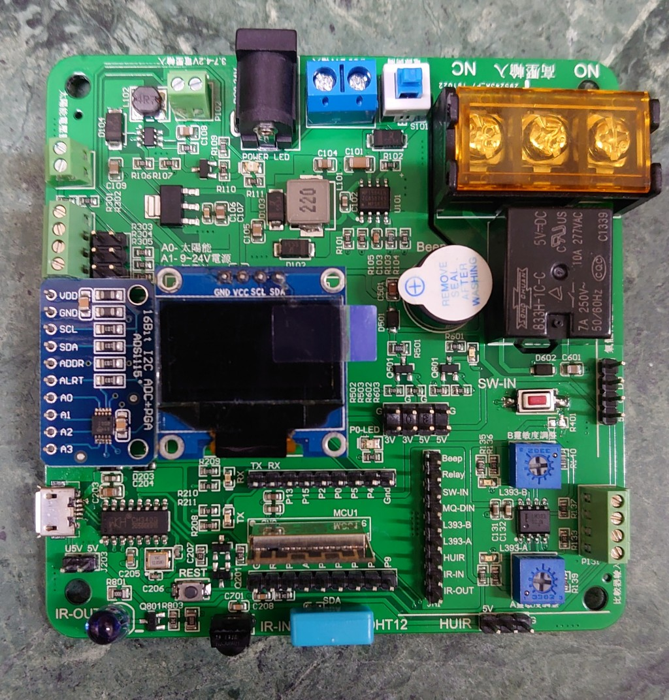
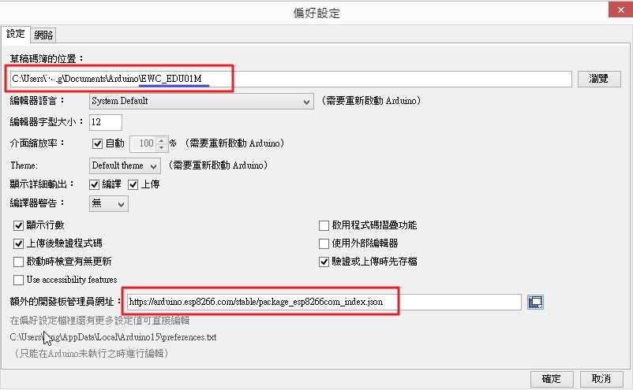
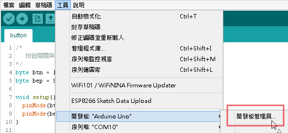
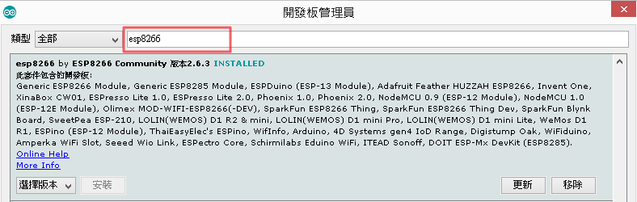
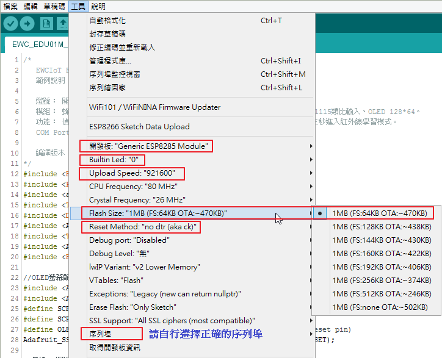

# EWCIoT EDU01M 開發版 #

----------

## 什麼是 EDU01M 開發版 ##
EDU01M 開發版是一塊可以使用 ARDUINO IDE 開發工具，進行物聯網二次開發的一塊學習板，板上內建了的功能包含蜂鳴器模組、繼電器開關、按鈕開關、紅外線接收模組、紅外線發射模組、 DHT12 溫濕度感測；在開發板的接口有預留 OLED 顯示屏幕、人體紅外線感應模組、MQ2 等相關氣體感測模組、兩組比較器輸入接口、ADS1115 的 16bit 類比輸入感測模組；在電源的輸入方面，除了燒錄的USB電源接口，還可以使用 24V 以下變壓器輸入、太陽能電池輸入、單顆 18650 電池輸入等等，此開發板使用 ESP8285 MCU，板子上包含了安信可原廠 ESP-01M WIFI 模組，在開發上完全相容 ESP8266 ，可做 WiFi 等物聯網程式開發應用。

## EDU01M 如何開發 ##
開發過程首先需要在電腦下載並安裝 ARDUINO IDE 開發工具，然後下載ESP8266開發庫，再連接 Micro USB 線到電腦，確認電腦系統正確驅動 USB ，取得正確 COM Port 號碼，接著就可以進行開發作業，在開發完成要上傳到開發板時，須將 P0 連接 GND 並按放重啟鈕，進入燒錄模式，燒錄完成後，會自動進入執行模式，開發需要用到的模組程式庫，已經收錄在 libraries 目錄中，以下列就依序列出開發過程，可能需要的相關連結，希望對您的物聯網開發有些許的幫助。

- ARDUINO IDE開發工具 
[https://www.arduino.cc/en/Main/Software](https://www.arduino.cc/en/Main/Software "https://www.arduino.cc/en/Main/Software")

- ESP8266開發庫下載連結設置 
https://arduino.esp8266.com/stable/package_esp8266com_index.json  
設置可以參考 [ESP8266 for Arduino IDE](https://github.com/esp8266/Arduino) 官網

- [CH340 USB轉TTL驅動](https://github.com/cypswu/EDU01M_Demo/raw/master/devices/CH341SER.zip) 

- 開發板相關模組程式庫 
[ADS1115 類比輸入](https://github.com/adafruit/Adafruit_ADS1X15) 
[SSD1306 OLED顯示屏幕](https://github.com/adafruit/Adafruit_SSD1306) 
[Arduino JSON 操作](https://github.com/bblanchon/ArduinoJson) 
[aRest 框架](https://github.com/marcoschwartz/aREST) 
[DHT12 溫濕度感測](https://github.com/xreef/DHT12_sensor_library) 
[紅外線輸入與輸出](https://github.com/cypswu/EWC_IR) 
[MQTT 通訊](https://pubsubclient.knolleary.net/) 
[LINE 通知](https://github.com/TridentTD/TridentTD_LineNotify) 
[WiFi 管理](https://github.com/tzapu/WiFiManager) 
[ESP 上傳工具](http://wiki.ai-thinker.com/tools) 

- [Arduino語法參考：https://www.arduino.cc/reference/en/](https://www.arduino.cc/reference/en/ "Arduino語法參考")

- [ESP8266參考手冊：https://arduino-esp8266.readthedocs.io/en/latest/](https://arduino-esp8266.readthedocs.io/en/latest/ "ESP8266參考手冊")

- [EDU01M開發版參考：https://github.com/cypswu/EDU01M_Demo](https://github.com/cypswu/EDU01M_Demo "EDU01M開發版參考")

- 整合測試
如果想要直接使用，可以參考[**"Demo/整合測試"**](https://github.com/cypswu/EDU01M_Demo/tree/master/Demo/%E6%95%B4%E5%90%88%E6%B8%AC%E8%A9%A6)的使用說明。

----------
## EDU01M 開發版第一次使用的系統配置 ##

1. EDU01M 開發板實機

 欣賞完 EDU01M 開發版後，可以開始動手安裝 Arduino IDE ，並設置開發環境。

2. 安裝 Arduino IDE 後，在選單的 **檔案 / 偏好設定** ，設置 ESP8266 的開發版程式庫來源。 
ESP01M 預設開發使用的程式庫由 [`EWC_EDU01M_libraries.zip`](https://github.com/cypswu/EDU01M_Demo/raw/master/libraries/EWC_EDU01M_libraries.zip "EWC_EDU01M_libraries.zip") 下載，然後解壓縮到 **Documents\Arduino** 目錄，再指定到**草稿碼簿的位置**。 
開發版來源 `https://arduino.esp8266.com/stable/package_esp8266com_index.json`  

3. 設置 ESP8266 的程式庫來源後，在選單的 **工具 / 開發版 / 開發版管理員**  

4. 搜尋並安裝 ESP8266 開發版程式庫，展示使用2.6.3版，使用者也可安裝最新版本，或許會有意外的開發功能，詳細差異可以查詢 [ESP8266參考手冊](https://arduino-esp8266.readthedocs.io/en/latest/) 。 

5. 當程式庫都安裝完成後，還需要確認開發版已取得正確的驅動程式，如果電腦從未安裝 [CH340 驅動程式](https://github.com/cypswu/EDU01M_Demo/raw/master/devices/CH341SER.zip)，請先安裝。

6. 上傳燒錄需要選擇正確的燒錄配置如下圖，燒錄上傳前， P0 要記得接地(GND)，然後按下 REST 黑色按鈕重啟，開發版會進入燒錄模式，上傳完成後就可以把 P0 與 GND 斷開。 

 完成以上的配置，就可以開始愉快的開發物聯網相關的應用了， [Demo](https://github.com/cypswu/EDU01M_Demo/tree/master/Demo) 目錄中，我已附上一些相關的應用範例，希望對您能有所幫助。
